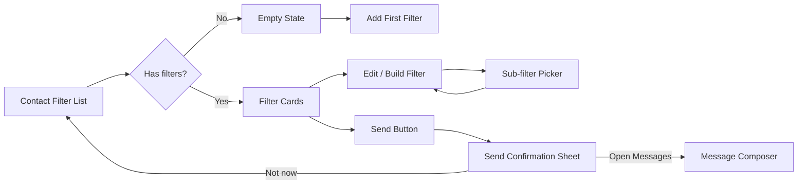

# SendAdv Soft Friendly Design Plan

## Goal and success criteria

Apply the new **Soft Friendly** visual direction from `design/project/SendAdv Soft Friendly.dc.html` to the iOS app.

Success means:
- The app uses one cohesive design system with matching **Light** and **Dark** appearances.
- The main Contact Filter flows match the prototype intent:
  - filter list
  - empty state
  - build/edit filter
  - sub-filter item picker
  - send confirmation / handoff to Messages
- Existing behavior remains unchanged unless explicitly listed in this plan.
- Accessibility, localization, SwiftData behavior, ads, and message sending continue to work.

## Source design interpretation

Primary source:
- `design/project/SendAdv Soft Friendly.dc.html`

Important clarification:
- The prototype contains **one design direction**: `Soft Friendly`.
- The two rows are not separate design options.
- They are the same design in two appearances:
  - `Soft Friendly · Light`
  - `Soft Friendly · Dark`

Reference-only source:
- `design/project/SendAdv Filter Designs.dc.html`
  - Contains earlier directions A/B/C.
  - Direction C is the ancestor of the final Soft Friendly concept.
  - Use only if a detail is missing from the primary file.

## Design language

Tone:
- Warm
- Rounded
- Friendly
- Calm but confident
- More guided than the current plain list UI

Core visual ideas:
- Soft warm background instead of flat system background.
- Rounded white / dark-violet cards with gentle elevation.
- Indigo primary action color.
- Category-coded filter icons:
  - Job: indigo
  - Department: peach
  - Organization: green
  - Disabled / Any: muted lavender-gray
- Large friendly titles and compact explanatory subtitles.
- Bottom primary action for sending, with a secondary reward/ad-free button.

## Design tokens

### Color tokens

| Role | Light | Dark | Usage |
|---|---:|---:|---|
| App background | `#FAF6F0` | `#17141F` | Root screen background |
| Primary text | `#2A2438` | `#F3F0F8` | Titles, important labels |
| Secondary text | `#9B93A8` | `#9A93A8` | Subtitles, helper text |
| Card surface | `#FFFFFF` | `#221E2E` | Rows, panels, fields |
| Native ad surface | `#F0F0F7` | `#252331` | Native ad card after filter cards |
| Muted surface | `#F0EEF4` | `#1C1926` | Disabled cards / neutral states |
| Primary accent | `#5B5BD6` | `#7C6BF0` | Save, selected, send button |
| Job tint bg | `#EEF0FF` | `#272338` | Job icon container |
| Job tint fg | `#5B5BD6` | `#9B8BF5` | Job icon / selected text |
| Department tint bg | `#FFF0E8` | `#2E2622` | Department icon container |
| Department tint fg | `#E8895B` | `#E8A07B` | Department icon / selected text |
| Organization tint bg | `#E8F8EF` | `#1E2D26` | Organization icon container |
| Organization tint fg | `#2BA55D` | `#5FCB8A` | Organization icon / selected text |
| Divider | `#F3F0F6` | `#2C2839` | Item list separators |
| Off toggle track | `#E6E2EC` | `#332E42` | Disabled toggles |

### Typography

Use SF Pro through SwiftUI system fonts.

| Role | Prototype | SwiftUI recommendation |
|---|---:|---|
| Main screen title | Large rounded title | `.system(size: 40, weight: .bold, design: .rounded)` |
| Main screen subtitle | Bold status text | `.title3.weight(.bold)` |
| Filter card title | Large rounded row title | `.system(size: 22, weight: .bold, design: .rounded)` |
| Filter card subtitle | Compact rounded summary | `.system(size: 16, weight: .semibold, design: .rounded)` |
| Detail title | 16 pt, weight 700 | `.headline.weight(.bold)` |
| Field value | 22 pt, weight 700 | `.title3.weight(.bold)` |
| Body helper | 13–15 pt | `.footnote` / `.subheadline` |
| Primary button | 17 pt, weight 700 | `.headline.weight(.bold)` |

### Radius and spacing

| Element | Radius / size |
|---|---:|
| Filter list card | 28 pt |
| Detail/filter cards | 20 pt |
| Search field | 14 pt |
| List group panel | 18 pt |
| Icon tile | 18 pt radius, 58 pt size |
| Bottom send button | 29 pt capsule radius, 58 pt height |
| Reward/ad-free button | 64 pt circle |
| Native ad card | 18 pt radius, minimum 118 pt height |
| Send confirmation sheet | 30 pt top corners |

### Elevation

Light mode:
- Cards: `0 6 18 rgba(91,91,214,0.07)`
- Reward button: `0 10 24 rgba(91,91,214,0.16)`
- Send button: `0 12 28 rgba(91,91,214,0.34)`

Dark mode:
- Cards: gentle black elevation, usually `rgba(0,0,0,0.30–0.40)`.
- Avoid bright white shadows.

## Screen specifications

### 1. Contact Filter List

Current app file candidates:
- `RecipientRuleListScreen.swift`
- `RecipientListRowView.swift`
- `RecipientComponents.swift`
- `WatchAdButton.swift`

Design requirements:
- Replace the current plain list look with warm background and rounded cards.
- Use an in-screen custom header instead of the default large navigation title.
- Prefer `ScrollView` + `LazyVStack` over `List` for this screen to avoid system list insets and to match the prototype spacing.
- Header copy should communicate status:
  - Example: `Your filters`
  - Subtitle: `3 turned on · ready to reach 24 people`
- Each filter row contains:
  - category-colored icon tile
  - title
  - concise filter summary
  - enabled toggle
- Disabled rows should appear muted with reduced opacity.
- Native Ad is still part of the product and must not be removed:
  - Do **not** place it between the header and the first filter card.
  - Do **not** place it near the fixed bottom CTA.
  - Place it after all filter cards as a secondary card with enough top spacing.
  - Align it to the same horizontal layout grid as the filter cards.
  - Avoid extra parent clipping; the `Ad` badge must not be cropped.
- Bottom action area:
  - fixed circular reward/ad-free button on the left
  - large primary send button on the right
  - layout rule: `HStack(spacing: 14) { giftButton.fixedSize; sendButton.fillRemainingWidth }`
  - no leading `Spacer()` before the gift button
  - CTA button background should fill the remaining width exactly; avoid adding horizontal padding after `frame(maxWidth: .infinity)`.
- Empty state should be centered and friendly:
  - large rounded illustration container
  - title: `No filters yet`
  - helper text explaining grouping by job/department/organization
  - primary CTA: `Add your first filter`

Implementation notes from first-screen iteration:
- Initial `design.md` interpretation was too chip/card-oriented. The actual first-screen prototype is:
  - large custom header,
  - large rounded filter cards,
  - left icon tile + title/subtitle + right toggle,
  - bottom fixed reward button + fill-width send pill.
- Native Ad should be visually secondary, but retained.
- Because `ScrollView` does not support `swipeActions`, delete can be exposed via context menu unless a custom swipe action is implemented later.
- Current send CTA count is based on enabled filter count. True recipient count like `24 people` requires async contact filtering and should be implemented separately.

### 2. Build / Edit Filter

Current app file candidates:
- `RuleDetailScreen.swift`
- `RuleDetailScreenModel.swift`

Design requirements:
- Use custom compact top bar instead of relying only on default navigation title.
- Back button: circular surface button.
- Center title: `New filter` or edit title.
- Save action: primary accent text.
- Name field is a rounded card:
  - label: `Give it a name`
  - title value in large bold text
- Filter categories shown as rounded cards:
  - Job
  - Department
  - Organization
- Each category card includes:
  - colored icon tile
  - category title
  - current selection summary
  - chevron

### 3. Sub-filter Item Picker

Current app file candidates:
- `RuleFilterScreen.swift`
- `RuleFilterScreenModel.swift`

Design requirements:
- Top bar includes:
  - circular back button
  - category icon + category title
  - Done action
- Helper copy:
  - `Pick which job titles this filter includes`
  - Adapt wording by category.
- Add search field:
  - Rounded surface
  - Search icon
  - Placeholder changes by category, e.g. `Search titles`
- Select all row:
  - title: `Select all titles`
  - subtitle: `Match everyone regardless of title`
  - toggle
- Section summary row:
  - left: item count, e.g. `7 titles`
  - right: selected count, e.g. `3 selected`
- Item list:
  - rounded grouped panel
  - selected rows use subtle accent background
  - selected indicator is filled circle with checkmark
  - unselected indicator is outlined circle

### 4. Send Confirmation / Messages Handoff

Current app file candidates:
- `RecipientRuleListScreen.swift`
- `MessageComposerView` integration

Design requirements:
- Before opening Messages, show a bottom confirmation sheet.
- Background filter list appears dimmed / de-emphasized.
- Sheet content:
  - handle bar
  - Messages-style icon tile
  - title: `Ready to send?`
  - explanation with recipient count highlighted
  - small recipient preview stack
  - primary button: `Open Messages`
  - secondary text action: `Not now`
- Keep current batching and contact permission behavior intact.

## Flow diagram

## Implementation plan

### Milestone 1 — Design system foundation

Owner: iOS developer

Deliverables:
- Add semantic SwiftUI colors for the Soft Friendly palette.
- Add reusable surface/card/button modifiers.
- Add category style helper for Job / Department / Organization / Any.
- Ensure colors have Light and Dark variants.

Suggested files:
- `Projects/App/Sources/Extensions/Color+.swift`
- `Projects/App/Resources/Assets.xcassets/Colors/`
- New file: `Projects/App/Sources/Views/Design/SoftFriendlyTheme.swift`

Verification:
- Light/Dark previews render with correct colors.
- Existing app compiles without changing behavior.

### Milestone 2 — Filter list refresh

Owner: iOS developer

Deliverables:
- Redesign `RecipientRuleListScreen` header, filter cards, empty state, Native Ad position, and bottom send area.
- Redesign `RecipientRuleRowView` as a large Soft Friendly filter card.
- Redesign `NativeAdRowView` as a secondary Soft Friendly ad card while preserving the AdMob `Ad` badge.
- Preserve toggles, ad/reward behavior, Tips, and message sending.
- Delete behavior: preserve deletion through context menu for this first-screen PR; consider custom swipe deletion in a follow-up if required.

Suggested files:
- `RecipientRuleListScreen.swift`
- `RecipientListRowView.swift`
- `RecipientComponents.swift`
- `WatchAdButton.swift`
- `NativeAdRowView.swift`

Verification:
- Existing filters display correctly.
- Empty state CTA creates a new filter.
- Toggle persists.
- Delete via context menu persists.
- Reward button still grants ad-free state.
- Native Ad displays below filter cards and the `Ad` badge is not cropped.
- Bottom CTA has equal outer horizontal margins; gift button is fixed width and send button fills the remaining width.

### Milestone 3 — Filter editor refresh

Owner: iOS developer

Deliverables:
- Redesign `RuleDetailScreen` with title field card and category cards.
- Keep unsaved-change confirmation behavior.
- Keep the recent fix: new filters are only inserted into SwiftData on Save.

Suggested files:
- `RuleDetailScreen.swift`
- `RuleDetailScreenModel.swift`

Verification:
- New → Back without saving does not create a row.
- New → Save creates a row.
- Edit → Save updates existing row.
- Edit → Discard keeps original values.

### Milestone 4 — Sub-filter picker refresh

Owner: iOS developer

Deliverables:
- Add search UI and selected count.
- Redesign selected/unselected item rows.
- Preserve selection and Done behavior.

Suggested files:
- `RuleFilterScreen.swift`
- `RuleFilterScreenModel.swift`

Verification:
- Search filters visible options without changing saved values until Done.
- Select all works.
- Selected count is accurate.

### Milestone 5 — Send confirmation sheet

Owner: iOS developer

Deliverables:
- Add confirmation sheet before launching Messages.
- Preserve current permission checks, no-rule warnings, batching, full-screen ad behavior, and review request behavior.

Suggested files:
- `RecipientRuleListScreen.swift`
- New reusable component: `SendConfirmationSheet.swift`

Verification:
- Tapping Send shows confirmation sheet.
- `Open Messages` launches current composer flow.
- `Not now` dismisses only the sheet.
- Batch sending still works.

## Dependencies and critical path

Critical path:
1. Design system foundation
2. Filter list cards and empty state
3. Filter editor cards
4. Sub-filter picker
5. Send confirmation sheet
6. Full build and simulator smoke test

Parallelization:
- After Milestone 1, filter list and filter editor can proceed in parallel.
- Sub-filter picker can proceed after category style helper is available.
- Send confirmation can proceed independently as long as the existing send function contract is preserved.

## Risks and mitigations

| Risk | Impact | Mitigation |
|---|---|---|
| Visual refresh accidentally changes persistence behavior | High | Keep model/view-model logic unchanged except where explicitly needed |
| Dark mode colors lack contrast | Medium | Test with iOS accessibility contrast and real Dark Mode previews |
| Send flow regressions | High | Wrap existing `onSendMessage()` rather than rewriting contact loading |
| Ad/reward button behavior breaks | Medium | Reuse existing `WatchAdButton` state and only change presentation |
| Large contact lists make picker slow | Medium | Add search/filtering efficiently and avoid expensive recomputation in body |

## Verification checklist

- [ ] `mise x -- tuist generate --no-open`
- [ ] `xcodebuild -workspace sendadv.xcworkspace -scheme App -configuration Debug -sdk iphonesimulator CODE_SIGNING_ALLOWED=NO build 2>&1 | xcsift -f toon -w`
- [ ] `mise x -- tuist build 2>&1 | xcsift -f toon -w`
- [ ] Light Mode manual smoke test
- [ ] Dark Mode manual smoke test
- [ ] Empty state → Add first filter
- [ ] New filter → Back without saving → no new row
- [ ] New filter → Save → row appears
- [ ] Edit filter → change title/category → Save persists
- [ ] Sub-filter picker → Select all / individual selection / Done
- [ ] Send button → confirmation sheet → Open Messages
- [ ] Contact permission denied path
- [ ] No active filters warning path
- [ ] Reward/ad-free button path

## Release checklist

- [ ] Feature branch PR with screenshots or simulator recordings
- [ ] PR body includes before/after user flow and accessibility notes
- [ ] Build & Test workflow passes
- [ ] TestFlight smoke test before App Store release
- [ ] Rollback plan: revert design PR; no data migration required
